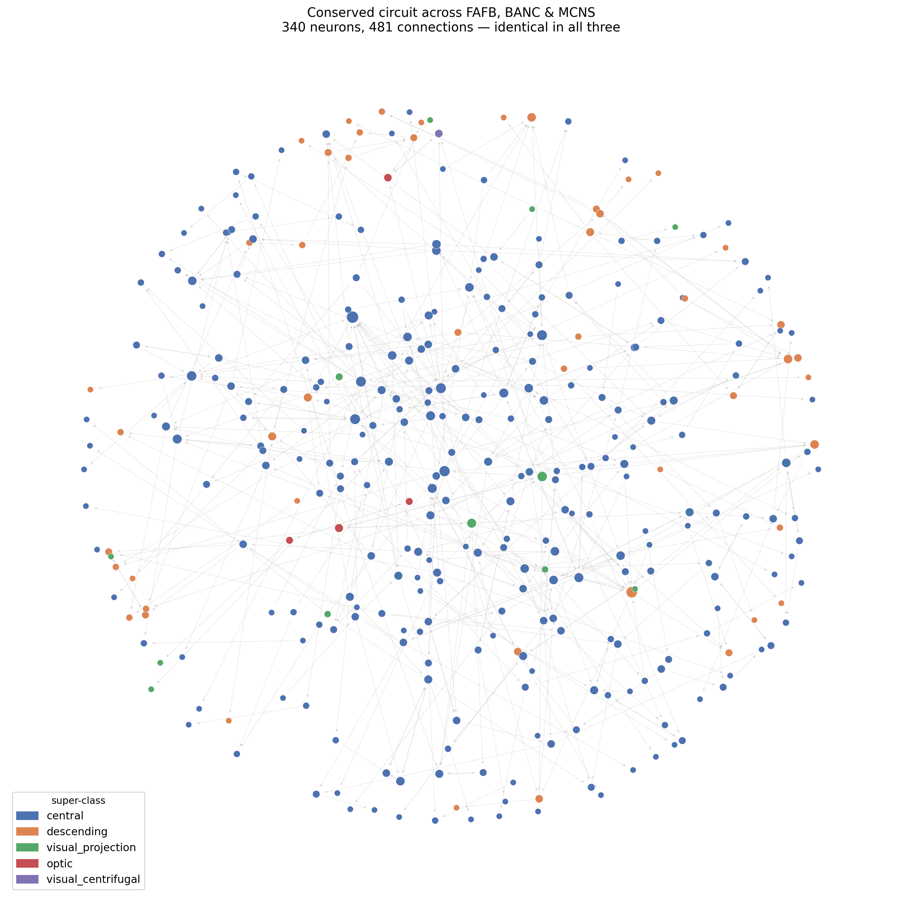
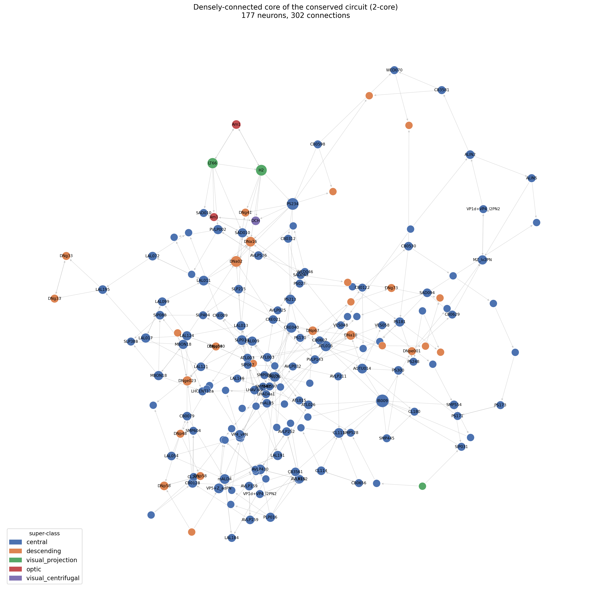
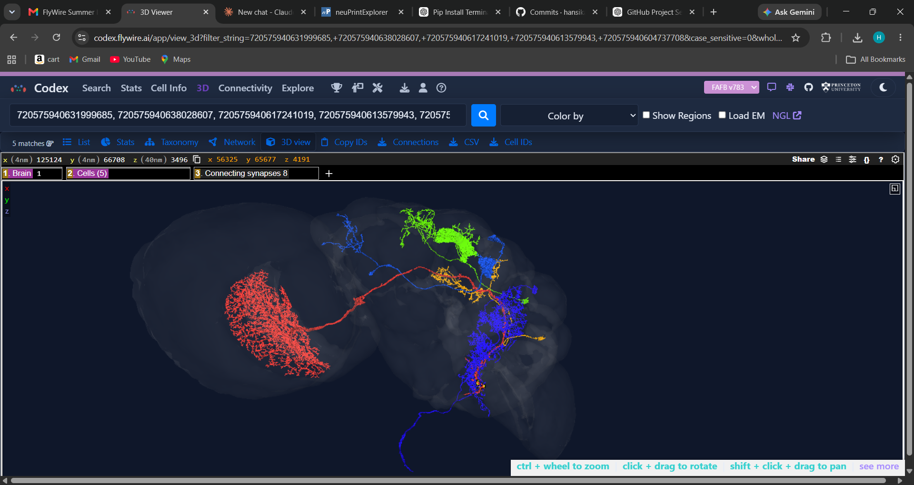

# A sex-invariant conserved core circuit of the *Drosophila* central brain

**Summary.** Searching for the largest circuit wired *identically* across three
*Drosophila* connectomes — FAFB and BANC (female) and MCNS (male) — yields a
**340-neuron, 481-connection** subnetwork whose directed connectivity is preserved
across all three brains. Rather than a single anatomical module, it is a
**distributed backbone spanning every major central-brain system**.

## The circuit
Neurons were matched across datasets by individually-identifiable cell type, and the
largest connected, perfectly-conserved induced subgraph was extracted (see `README.md`
for the method).

*Figure 1. All 340 conserved neurons (FAFB layout), coloured by super-class. Central
neurons (blue) form the integrative bulk; descending neurons (orange) sit at the
periphery as outputs.*

*Figure 2. The densely-connected 2-core (177 neurons), labelled by cell type — the
interconnected backbone of the circuit.*

*Figure 3. Codex 3D meshes of five representative neurons in the FAFB brain, one per
system: H2 (vision), DC4_adPN (olfaction), MBON06 (memory), FB5K (navigation), DNa02
(motor command).*

## Observations
By super-class the circuit comprises 274 central-brain neurons, **49 descending
neurons** (brain → nerve-cord command outputs), 12 visual-projection neurons, and a
few optic/centrifugal neurons. By functional class it spans olfactory projection and
local neurons (ALPN, ALLN, lateral horn), mushroom-body memory neurons (MBON, MBIN,
Kenyon cells), central-complex navigation neurons (CX, lateral accessory lobe), higher
multimodal protocerebrum (AVLP/PVLP/SLP), and descending command neurons. Together
these trace a complete **sensory → integration → command** axis. The steering
descending neuron **DNa02**, known to lie downstream of the central complex, appears
in the circuit and directly links its navigation and motor-output components.

## Interpretation & hypothesis
I was genuinely surprised that as many as 340 neurons matched exactly — I only reached
this number after several rounds of searching — because the three datasets come from
different individuals, different sexes, and different imaging and reconstruction
pipelines. That so much wiring turns out to be *identical* across them suggests these
are not coincidental matches but a real, conserved part of the brain, and it was
striking to map and visualise that shared circuit in 3D.

My interpretation is that these are the neurons responsible for the brain's basic,
common functions rather than sex-specific ones. This fits what is known about sexual
dimorphism in the fly: dimorphism is genetically driven by the *fruitless* and
*doublesex* genes and is concentrated in a small set of higher-brain circuits that
control courtship and aggression [4]. When the male and female central brains were
directly compared, roughly 7,200 of ~7,300 cross-matched cell types (~98%) were found
to be isomorphic between the sexes, with only ~114 dimorphic and a few hundred
sex-specific types, and the dimorphic neurons were concentrated in higher brain centres
while the sensory and motor periphery stayed largely the same [4]. The circuit I
recovered sits squarely in that conserved majority — it spans olfaction, vision,
memory, navigation and motor command, the everyday sensory-to-motor machinery both
sexes need, and it excludes the dimorphic courtship/aggression circuitry, which differs
between brains and therefore cannot appear in an *identically*-wired set.

I therefore hypothesise that this 340-neuron circuit is a hardwired, conserved **core
scaffold** of the *Drosophila* central brain: the wiring that is canalised by
development and shared across individuals and sexes because it underlies functions
common to the whole species, while the more variable, sexually-dimorphic circuitry is
filtered out precisely because its connectivity is not the same across all three
brains.

## Caveats
Edge weights were ignored and connectivity is defined up to each dataset's synapse
threshold; matching used unambiguous singleton (cell type, side) cells; self-loops were
excluded; and N = 340 is a verified lower bound from heuristic search, not a proven
maximum.

## References
1. Dorkenwald S. *et al.* (2024). Neuronal wiring diagram of an adult brain. *Nature* 634, 124-138.
2. Schlegel P. *et al.* (2024). Whole-brain annotation and multi-connectome cell typing of *Drosophila*. *Nature* 634, 139-152.
3. Bates A. S. *et al.* (2025). Distributed control circuits across a brain-and-cord connectome (BANC). *bioRxiv* 2025.07.31.667571.
4. Berg S. *et al.* (2025). Sexual dimorphism in the complete connectome of the *Drosophila* male central nervous system. *bioRxiv* 2025.10.09.680999.
